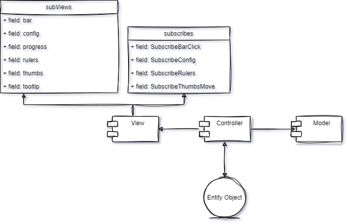

<h2>Slider Plugin</h2>

<a href="https://eclipsemode.github.io/Range-slider-app/" target="_blank">--- Watch Demo ---</a>
<h3>Libraries:</h3>

<pre>
  "devDependencies": {
    "@types/jest": "^27.5.1",
    "@types/jquery": "^3.5.14",
    "@typescript-eslint/eslint-plugin": "^5.21.0",
    "@typescript-eslint/parser": "^5.21.0",
    "css-loader": "^6.7.1",
    "eslint": "^8.14.0",
    "eslint-config-airbnb-base-typescript-prettier": "^5.1.0",
    "eslint-webpack-plugin": "^3.1.1",
    "jest": "^28.1.0",
    "jest-environment-jsdom": "^28.1.0",
    "js-abbreviation-number": "^1.4.0",
    "jsdom": "^19.0.0",
    "prettier": "^2.8.0",
    "pug": "^3.0.2",
    "pug-plugin": "^4.5.0",
    "sass": "^1.51.0",
    "sass-loader": "^12.6.0",
    "ts-jest": "^28.0.3",
    "ts-loader": "^9.3.0",
    "typescript": "^4.6.4",
    "webpack": "^5.72.0",
    "webpack-cli": "^4.9.2",
    "webpack-dev-server": "^4.8.1",
    "gh-pages": "^4.0.0"
  },
  "dependencies": {
    "jquery": "^3.6.0"
  }
</pre>

<h3>Commands:</h3>

Commands call with <code>npm</code> or <code>yarn</code>.

Install dependencies: <code>npm i</code> or <code>yarn</code>.

Start tests with: <code>npm run test</code> or <code>yarn test</code>

Start development server: <code>npm start</code>

Assemble the project with command: <code>npm run build</code> 

<h3>Slider initialization:</h3>

<pre>
import Controller from './Controller';

new Controller('.slider', {...options})
</pre>

<h4>User options: </h4>
<table>
<thead>
<td>Name</td>
<td>Type</td>
<td>Default value</td>
<td>Description</td>
</thead>
<tbody>
<tr>
<td>min</td>
<td>number</td>
<td>0</td>
<td>Minimum value</td>
</tr>
<tr>
<td>max</td>
<td>number</td>
<td>1000</td>
<td>Maximum value</td>
</tr>
<tr>
<td>step</td>
<td>number</td>
<td>0.1</td>
<td>Step if thumbs</td>
</tr>
<tr>
<td>from</td>
<td>number</td>
<td>0</td>
<td>Value of first / min thumb</td>
</tr>
<tr>
<td>to</td>
<td>number</td>
<td>1000</td>
<td>Value of second / max thumb</td>
</tr>
<tr>
<td>range</td>
<td>boolean</td>
<td>false</td>
<td>Double / single range slider</td>
</tr>
<tr>
<td>vertical</td>
<td>boolean</td>
<td>false</td>
<td>Orientation</td>
</tr>
<tr>
<td>progress</td>
<td>boolean</td>
<td>true</td>
<td>Scale display</td>
</tr>
<tr>
<td>tooltip</td>
<td>boolean</td>
<td>true</td>
<td>Show tooltip above thumbs</td>
</tr>
<tr>
<td>configPanel</td>
<td>boolean</td>
<td>true</td>
<td>Show config panel</td>
</tr>
<tr>
<td>color</td>
<td>string</td>
<td>{firstColor?: #ffe53b;
    secondColor?: #ff2525;
    textColor?: #ffe53b;
    thumbColor?: #ffe53b; }</td>
<td>Set color</td>
</tr>
</tbody>
</table>

<h3>Architecture:</h3>

Architecture of slider based on MVP pattern. 
Application divided on 3 components - <code>Model</code>, <code>View</code>, <code>Controller</code>, 
and this components synchronized with subscriptions. View architecture divided on subscriptions and subViews, which in turn connected in main View.ts.

<h3>UML:</h3>

In progress...
